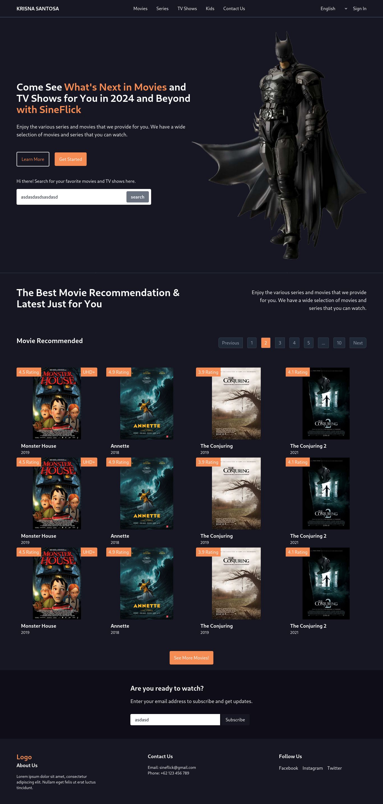

# TEASER

# SineFlick

SineFlick is a website that provides recommendations for movies. Whether you're looking for the latest blockbusters, hidden gems, or timeless classics, SineFlick has got you covered. With our curated collection of movies from various genres, you'll never run out of options for your movie nights.

## Features

- Browse through a vast collection of movies
- Filter movies by genre, release year, and rating
- Get personalized movie recommendations based on your preferences
- Read detailed movie descriptions, reviews, and ratings
- Create and manage your watchlist
- Interact with other movie enthusiasts through comments and discussions

## Installation

To run SineFlick locally, follow these steps:

1. Clone the repository: `git clone https://github.com/krisnasantosa15/sineflick.git`
2. Open the project directory: `cd sineflick`
3. Open the `index.html` file in your browser

## License

This project is licensed under the [MIT License](LICENSE).

## Contact

If you have any questions or suggestions, feel free to reach out to us at [krisnasantosa@upi.edu](mailto:krisnasantosa@upi.edu).

Happy movie watching!

